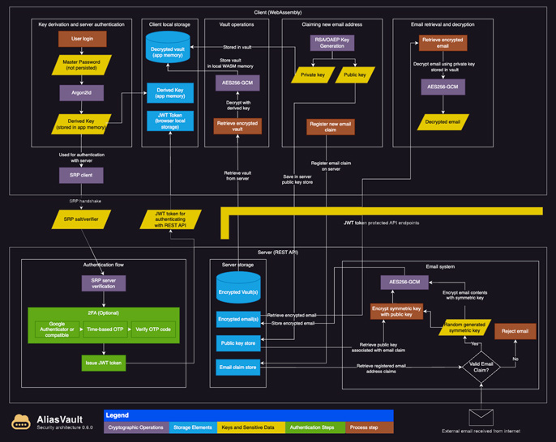

#  AliasVault
AliasVault is a privacy-first password and email alias manager. Create unique identities, strong passwords, and random email aliases for every website you use. Fully end-to-end encrypted, with a built-in email server and zero third-party dependencies.

[](https://github.com/lanedirt/AliasVault/releases)
[](https://github.com/lanedirt/AliasVault/actions/workflows/dotnet-e2e-tests.yml)
[](https://sonarcloud.io/summary/new_code?id=lanedirt_AliasVault)
[](https://crowdin.com/project/aliasvault)
[](https://discord.gg/DsaXMTEtpF)

<a href="https://app.aliasvault.net">Try the cloud version 🔥</a> | <a href="https://aliasvault.net?utm_source=gh-readme">Website </a> | <a href="https://docs.aliasvault.net?utm_source=gh-readme">Documentation </a> | <a href="#self-hosting">Self-host instructions</a>

⭐ Star us on GitHub, it motivates us a lot!

## About
Built on 15 years of experience, AliasVault is independent, open-source, self-hostable and community-driven. It’s the response to a web that tracks everything: a way to take back control of your digital privacy and help you stay secure online.

– Leendert de Borst ([@lanedirt](https://github.com/lanedirt)), Creator of AliasVault

## Screenshots

<table>
    <tr>
        <th align="center">Responsive web app</th>
        <th align="center">Browser extensions</th>
    </tr>
    <tr>
        <td align="center">
            
        </td>
        <td align="center">
            
		</td>
    </tr>
    <tr>
        <th align="center">Native iOS & Android apps</th>
        <th align="center">& much more</th>
    </tr>
    <tr>
		<td align="center">
            
		</td>
		<td align="center">
           
        </td>
	</tr>
</table>

## Cloud-hosted
Use the official cloud version of AliasVault at [app.aliasvault.net](https://app.aliasvault.net). This fully supported platform is always up to date with our latest release.

AliasVault is available on:
- [Web (universal)](https://app.aliasvault.net)
- [Chrome](https://chromewebstore.google.com/detail/aliasvault/bmoggiinmnodjphdjnmpcnlleamkfedj)
- [Firefox](https://addons.mozilla.org/en-US/firefox/addon/aliasvault/)
- [Edge](https://microsoftedge.microsoft.com/addons/detail/aliasvault/kabaanafahnjkfkplbnllebdmppdemfo)
- [Safari](https://apps.apple.com/app/id6743163173)

<p>
  <a href="https://apps.apple.com/app/id6745490915" style="display: inline-block; margin-right: 20px;"></a>
  <a href="https://play.google.com/store/apps/details?id=net.aliasvault.app" style="display: inline-block;"></a>
      <a href="https://f-droid.org/packages/net.aliasvault.app" style="display: inline-block;"></a>
</p>

[](https://app.aliasvault.net)

## Self-hosting
For full control over your own data you can self-host and install AliasVault on your own servers.

### Install using install script

This method uses pre-built Docker images and works on minimal hardware specifications:

- 64-bit Linux VM (Ubuntu/AlmaLinux) or Raspberry Pi, with root access
- Minimum: 1 vCPU, 1GB RAM, 16GB disk
- Docker ≥ 20.10 and Docker Compose ≥ 2.0

```bash
# Download install script from latest stable release
curl -L -o install.sh https://github.com/lanedirt/AliasVault/releases/latest/download/install.sh

# Make install script executable and run it. This will create the .env file, pull the Docker images, and start the AliasVault containers.
chmod +x install.sh
./install.sh install
```

The install script will output the URL where the app is available. By default this is:
- Client: https://localhost
- Admin portal: https://localhost/admin

> Note: If you want to change the default AliasVault ports you can do so in the `.env` file.

## Technical documentation
For more information about the installation process, manual setup instructions and other topics, please see the official documentation website:
- [Documentation website (docs.aliasvault.net) 📚](https://docs.aliasvault.net)

## Security Architecture
<a href="https://docs.aliasvault.net/architecture"></a>

AliasVault takes security seriously and implements various measures to protect your data:

- All sensitive user data is encrypted end-to-end using industry-standard encryption algorithms. This includes the complete vault contents and all received emails.
- Your master password never leaves your device.
- Zero-knowledge architecture ensures the server never has access to your unencrypted data

For detailed information about our encryption implementation and security architecture, see the following documents:
- [SECURITY.md](SECURITY.md)
- [Security Architecture Diagram](https://docs.aliasvault.net/architecture)

## Features & Roadmap

AliasVault is under active development, with a strong focus on usability, security, and cross-platform support.
The main focus is on ensuring robust usability for everyday tasks, including comprehensive autofill capabilities across all platforms.

🛠️ Incremental releases are published every 2–3 weeks, with a strong emphasis on real-world testing and user feedback.
During this phase, AliasVault can safely be used in production as it maintains strict data integrity and automatic migration guarantees.

Core features that are being worked on:

- [x] Core password & alias management
- [x] Full end-to-end encryption
- [x] Built-in email server for aliases
- [x] Easy self-hosted installer
- [x] Browser extensions with autofill feature (Chrome, Firefox, Edge, Safari, Brave)
- [x] Built-in TOTP authenticator
- [x] Import passwords from traditional password managers
- [x] iOS native app
- [x] Android native app
- [x] Editing in browser extension
- [x] Multi-language support across all client applications
- [ ] Data model and usability improvements (more flexible aliases and credential types, folder support, bulk selecting etc.)
- [ ] Support for FIDO2/WebAuthn hardware keys and passkeys
- [ ] Adding support for family/team sharing (organization features)

👉 [View the full AliasVault roadmap here](https://github.com/lanedirt/AliasVault/issues/731)

### Got feedback or ideas?
Feel free to open an issue or join our [Discord](https://discord.gg/DsaXMTEtpF)! Contributions are warmly welcomed—whether in feature development, testing, or spreading the word. Get in touch on Discord if you're interested in contributing.

### Support the mission
Your donation helps me dedicate more time and resources to improving AliasVault, making the internet safer for everyone!

<a href="https://www.buymeacoffee.com/lanedirt" target="_blank"></a>
